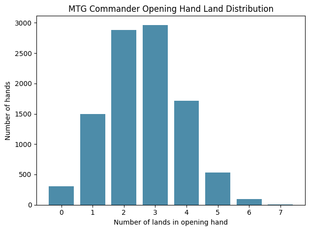

# MTG Commander Opening Hand Monte Carlo Simulator

This Python script simulates drawing opening hands from a Magic: The Gathering Commander deck, letting you estimate the probability of drawing a specific number of lands—and visualize the results with a histogram.

## Features

- Accepts any decklist (.txt, 1 card per line; supports "N Card Name" or "Card Name" formats)
- Uses Scryfall’s API (with local cache) for perfect accuracy in recognizing land cards—even nonbasics!
- User-configurable: Number of simulated hands, minimum/maximum desired land count
- Displays the full distribution of land counts in opening hands, as a table and as a matplotlib histogram

## Thanks
Made with help from Scryfall for card data.